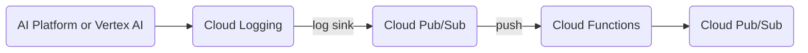

# AI Platform Notification

[](https://github.com/sfujiwara/terraform-google-ai-platform-notification/actions/workflows/config.yml)
[](LICENSE)
[](https://github.com/psf/black)

This is an implementation to notify status changes of AI Platform Training and Vertex AI Training.

Unfortunately, [AI Platform and Vertex AI do not support notification of status changes](https://stackoverflow.com/questions/59892910/is-there-a-way-to-be-notified-of-status-changes-in-google-ai-platform-training-j).
This module might be helpful until the notification is officially supported.

## Architecture

The architecture is as below:



This Terraform module creates resources below:

| Resource                   | Description |
|:---------------------------|:------------|
| Log sink                   | Log sink sends AI Platform logs to Pub/Sub log topic. |
| Pub/Sub log topic          | This topic receives AI Platform logs via log sink. |
| Cloud Storage bucket       | This bucket is used to save source code for Cloud Functions. |
| Cloud Storage object       | This object is archived source code for Cloud Functions. |
| Cloud Functions            | This function receives AI Platform logs from Pub/Sub log topic, check the job state, and publish a message to the notification topic. |
| Pub/Sub notification topic | This topic receives resulting message of AI Platform job state from Cloud Functions. |

## Message

The message published to notification topic is as below:

```json
{
  "job_id": "<AI Platform training job ID>",
  "project_id": "<Your GCP project ID>",
  "timestamp": "2020-12-23T21:02:36.069049148Z",
  "job_state": "SUCCEEDED"
}
```

`job_state` is `QUEUED`, `SUCCEEDED`, `CANCELLED`, or `FAILED`.

## Usage

```terraform
module "ai_platform_notification" {
  source  = "git::https://github.com/sfujiwara/terraform-google-ai-platform-notification.git?ref=vX.X.X"
  project = "your-project-id"
  label   = {
    key   = "notification"
    value = "hoge"
  }
}
```

## Terraform Docs

This section is automatically generated with [terraform-docs](https://github.com/terraform-docs/terraform-docs).

<!-- BEGIN_TF_DOCS -->

### Inputs

| Name | Description | Type | Default | Required |
|------|-------------|------|---------|:--------:|
| project | Google Cloud Platform project ID. | `string` | n/a | yes |
| region | Region of Cloud Functions and Cloud Storage bucket. | `string` | n/a | yes |
| label | Statuses of jobs with label `key:value` are published to Pub/Sub. If both key and value are `null`, all jobs are the targets (for compatibility). | <pre>object({<br>    key   = string<br>    value = string<br>  })</pre> | <pre>{<br>  "key": null,<br>  "value": null<br>}</pre> | no |
| log\_topic | Pub/Sub topic name for log sink. | `string` | `"ai-platform-log"` | no |
| notification\_topic | Pub/Sub topic name for notification message. | `string` | `"ai-platform-notification"` | no |

### Outputs

| Name | Description |
|------|-------------|
| log\_topic | Pub/Sub topic name for log sink. |
| notification\_topic | Pub/Sub topic name for notification message. |

<!-- END_TF_DOCS -->
